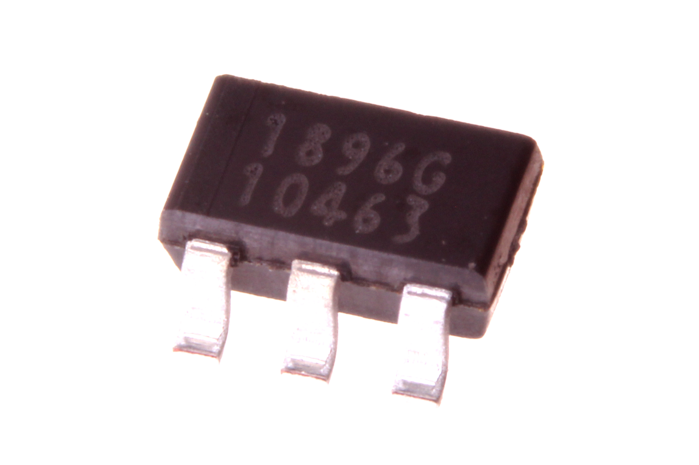
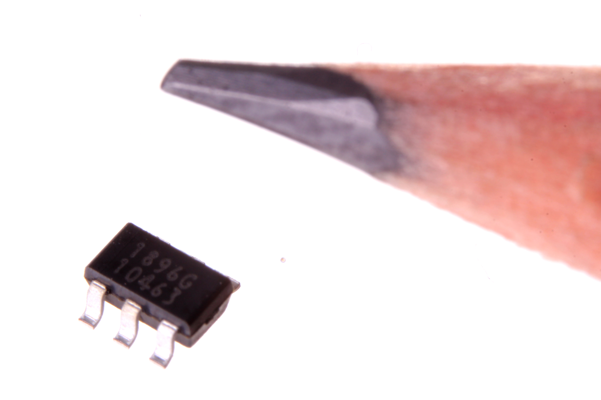
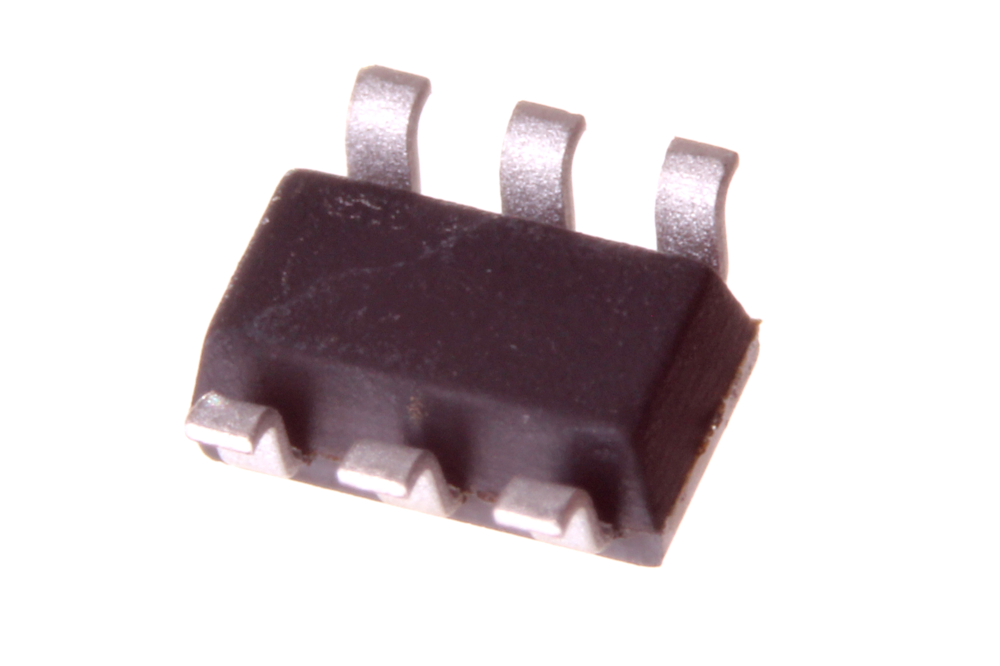
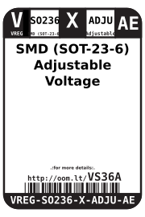
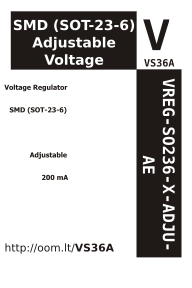

Contents
========

* [VREG-SO236-X-ADJU-AE>SMD (SOT-23-6) Adjustable Voltage Regulator 200 mA](#vreg-so236-x-adju-aesmd-sot-23-6-adjustable-voltage-regulator-200-ma)
	* [Images](#images)
	* [Datasheets](#datasheets)
	* [Labels](#labels)
	* [EDA](#eda)
		* [Symbols](#symbols)
	* [Tags](#tags)
  
![][im]
# VREG-SO236-X-ADJU-AE>SMD (SOT-23-6) Adjustable Voltage Regulator 200 mA

- ID: VREG-SO236-X-ADJU-AE
- Name: VREG-SO236-X-ADJU-AE

## Images
  
  

|Main|Reference|Bottom|
| :---: | :---: | :---: |
||||

## Datasheets

- Datasheet: [datasheet.pdf](datasheet.pdf)

## Labels
  
  

|Front|Inventory|Specifications|
| :---: | :---: | :---: |
||||

## EDA

### Symbols

## Tags

- hexID: VS36A
- oompSort: VREGSO236ADJU
- oompType: VREG
- oompSize: SO236
- oompColor: X
- oompDesc: ADJU
- oompIndex: AE
- oompVersion: 98
- ooDesignator: U1

[im]: image_600.jpg
