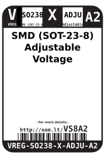
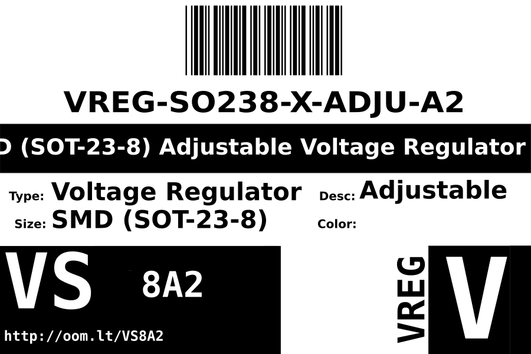
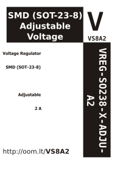

Contents
========

* [VREG-SO238-X-ADJU-A2>SMD (SOT-23-8) Adjustable Voltage Regulator 2 A](#vreg-so238-x-adju-a2smd-sot-23-8-adjustable-voltage-regulator-2-a)
	* [Datasheets](#datasheets)
	* [Labels](#labels)
	* [EDA](#eda)
		* [Symbols](#symbols)
	* [Tags](#tags)

# VREG-SO238-X-ADJU-A2>SMD (SOT-23-8) Adjustable Voltage Regulator 2 A

- ID: VREG-SO238-X-ADJU-A2
- Name: VREG-SO238-X-ADJU-A2

## Datasheets

- Datasheet: [datasheet.pdf](datasheet.pdf)

## Labels
  
  

|Front|Inventory|Specifications|
| :---: | :---: | :---: |
||||

## EDA

### Symbols

## Tags

- index: 822
- oompID: VREG-SO238-X-ADJU-A2
- name: SMD (SOT-23-8) Adjustable Voltage Regulator 2 A
- hexID: VS8A2
- oompSort: 
- oompClass: Surface Mount
- oompClassCode: SMDS
- oompType: VREG
- oompSize: SO238
- oompColor: X
- oompDesc: ADJU
- oompIndex: A2
- oompVersion: 40
- ooDesignator: U1
