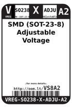

Contents
========

* [VS8A2 > SMD (SOT-23-8) Adjustable Voltage Regulator 2 A](#vs8a2--smd-sot-23-8-adjustable-voltage-regulator-2-a)
	* [Datasheets](#datasheets)
	* [Labels](#labels)
	* [EDA](#eda)
	* [Images](#images)
	* [Tags](#tags)

# VS8A2 > SMD (SOT-23-8) Adjustable Voltage Regulator 2 A

- ID: VREG-SO238-X-ADJU-A2
- Hex ID: VS8A2
- Name: SMD (SOT-23-8) Adjustable Voltage Regulator 2 A
- Description: SMD (SOT-23-8) Adjustable Voltage Regulator 2 A
- Long Link: [http://oom.lt/VREG-SO238-X-ADJU-A2](http://oom.lt/VREG-SO238-X-ADJU-A2)
- Short Link: [http://oom.lt/VS8A2](http://oom.lt/VS8A2)

## Datasheets

- Datasheet: [datasheet.pdf](datasheet.pdf)

## Labels
  
  

|label-front|label-inventory|label-spec|
| :---: | :---: | :---: |
||||

## EDA

### Symbols

## Images
  
  

|label-front|label-inventory|label-spec|
| :---: | :---: | :---: |
||||

## Tags

- oompID: VREG-SO238-X-ADJU-A2
- name: SMD (SOT-23-8) Adjustable Voltage Regulator 2 A
- hexID: VS8A2
- oompSort: 
- oompClass: Surface Mount
- oompClassCode: SMDS
- oompType: VREG
- oompSize: SO238
- oompColor: X
- oompDesc: ADJU
- oompIndex: A2
- oompVersion: 40
- ooDesignator: U1
