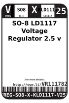
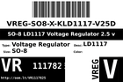
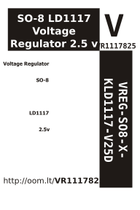

Contents
========

* [VR1117825 > ](#vr1117825--)
	* [Datasheets](#datasheets)
	* [Labels](#labels)
	* [EDA](#eda)
	* [Images](#images)
	* [Tags](#tags)

# VR1117825 > 

- ID: VREG-SO8-X-KLD1117-V25D
- Hex ID: VR1117825
- Name: 
- Description: 
- Long Link: [http://oom.lt/VREG-SO8-X-KLD1117-V25D](http://oom.lt/VREG-SO8-X-KLD1117-V25D)
- Short Link: [http://oom.lt/VR1117825](http://oom.lt/VR1117825)

## Datasheets

- Datasheet: [datasheet.pdf](datasheet.pdf)

## Labels
  
  

|label-front|label-inventory|label-spec|
| :---: | :---: | :---: |
||||

## EDA

## Images
  
  

|label-front|label-inventory|label-spec|
| :---: | :---: | :---: |
||||

## Tags

- oompType: VREG
- oompSize: SO8
- oompColor: X
- oompDesc: KLD1117
- oompIndex: V25D
- hexID: VR1117825
- oompID: VREG-SO8-X-KLD1117-V25D
