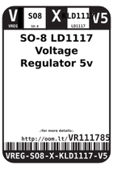
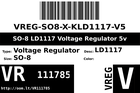
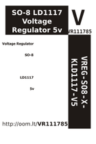

Contents
========

* [VR111785 > SO-8 LD1117 Voltage Regulator 5v](#vr111785--so-8-ld1117-voltage-regulator-5v)
	* [Datasheets](#datasheets)
	* [Labels](#labels)
	* [EDA](#eda)
	* [Images](#images)
	* [Tags](#tags)

# VR111785 > SO-8 LD1117 Voltage Regulator 5v

- ID: VREG-SO8-X-KLD1117-V5
- Hex ID: VR111785
- Name: SO-8 LD1117 Voltage Regulator 5v
- Description: SO-8 LD1117 Voltage Regulator 5v
- Long Link: [http://oom.lt/VREG-SO8-X-KLD1117-V5](http://oom.lt/VREG-SO8-X-KLD1117-V5)
- Short Link: [http://oom.lt/VR111785](http://oom.lt/VR111785)

## Datasheets

- Datasheet: [datasheet.pdf](datasheet.pdf)

## Labels
  
  

|label-front|label-inventory|label-spec|
| :---: | :---: | :---: |
||||

## EDA

## Images
  
  

|label-front|label-inventory|label-spec|
| :---: | :---: | :---: |
||||

## Tags

- oompType: VREG
- oompSize: SO8
- oompColor: X
- oompDesc: KLD1117
- oompIndex: V5
- hexID: VR111785
- oompID: VREG-SO8-X-KLD1117-V5
