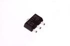

Contents
========

* [VS831 > SMD (SOT-89) 3.3v Voltage Regulator 1 A](#vs831--smd-sot-89-33v-voltage-regulator-1-a)
	* [Datasheets](#datasheets)
	* [Labels](#labels)
	* [EDA](#eda)
	* [Images](#images)
	* [Tags](#tags)
  
![][im]
# VS831 > SMD (SOT-89) 3.3v Voltage Regulator 1 A

- ID: VREG-SO89-X-V33D-A1
- Hex ID: VS831
- Name: SMD (SOT-89) 3.3v Voltage Regulator 1 A
- Description: SMD (SOT-89) 3.3v Voltage Regulator 1 A
- Long Link: [http://oom.lt/VREG-SO89-X-V33D-A1](http://oom.lt/VREG-SO89-X-V33D-A1)
- Short Link: [http://oom.lt/VS831](http://oom.lt/VS831)

## Datasheets

- Datasheet: [datasheet.pdf](datasheet.pdf)

## Labels
  
  

|label-front|label-inventory|label-spec|
| :---: | :---: | :---: |
||||

## EDA

### Symbols

## Images
  
  

|image|image_RE|image_BOTTOM|label-front|label-inventory|label-spec|
| :---: | :---: | :---: | :---: | :---: | :---: |
|||||||

## Tags

- oompID: VREG-SO89-X-V33D-A1
- name: SMD (SOT-89) 3.3v Voltage Regulator 1 A
- hexID: VS831
- oompSort: SO893.301.000
- oompType: VREG
- oompSize: SO89
- oompColor: X
- oompDesc: V33D
- oompIndex: A1
- oompVersion: 99
- ooManufacturer: C-JCST
- ooManufacturerPartNumber: CJA1117B-3.3
- ooSEEEDsku: 1310120P1
- ooSEEEDdesc: 1A LOW DROPOUT LINEAR REGULATOR 3.3V
- ooSEEED3dModel: http://www.seeedstudio.com/wiki/File:SOT89.zip
- oompClass: Surface Mount
- oompClassCode: SMDS
- ooDesignator: U1

[im]: image_450.jpg
