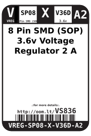
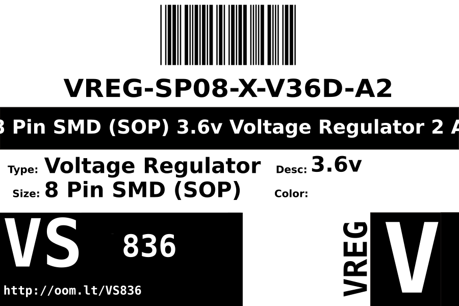

Contents
========

* [VREG-SP08-X-V36D-A2>8 Pin SMD (SOP) 3.6v Voltage Regulator 2 A](#vreg-sp08-x-v36d-a28-pin-smd-sop-36v-voltage-regulator-2-a)
	* [Datasheets](#datasheets)
	* [Labels](#labels)
	* [EDA](#eda)
		* [Symbols](#symbols)
	* [Tags](#tags)

# VREG-SP08-X-V36D-A2>8 Pin SMD (SOP) 3.6v Voltage Regulator 2 A

- ID: VREG-SP08-X-V36D-A2
- Name: VREG-SP08-X-V36D-A2

## Datasheets

- Datasheet: [datasheet.pdf](datasheet.pdf)

## Labels
  
  

|label-front|label-inventory|label-spec|
| :---: | :---: | :---: |
||||

## EDA

### Symbols

## Tags

- oompID: VREG-SP08-X-V36D-A2
- name: 8 Pin SMD (SOP) 3.6v Voltage Regulator 2 A
- hexID: VS836
- oompSort: VREGSP08V36D
- oompType: VREG
- oompSize: SP08
- oompColor: X
- oompDesc: V36D
- oompIndex: A2
- oompVersion: 98
- ooDesignator: U1
