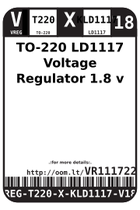
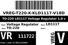
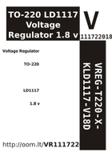

Contents
========

* [VR111722018 > ](#vr111722018--)
	* [Datasheets](#datasheets)
	* [Labels](#labels)
	* [EDA](#eda)
	* [Images](#images)
	* [Tags](#tags)

# VR111722018 > 

- ID: VREG-T220-X-KLD1117-V18D
- Hex ID: VR111722018
- Name: 
- Description: 
- Long Link: [http://oom.lt/VREG-T220-X-KLD1117-V18D](http://oom.lt/VREG-T220-X-KLD1117-V18D)
- Short Link: [http://oom.lt/VR111722018](http://oom.lt/VR111722018)

## Datasheets

- Datasheet: [datasheet.pdf](datasheet.pdf)

## Labels
  
  

|label-front|label-inventory|label-spec|
| :---: | :---: | :---: |
||||

## EDA

## Images
  
  

|label-front|label-inventory|label-spec|
| :---: | :---: | :---: |
||||

## Tags

- oompType: VREG
- oompSize: T220
- oompColor: X
- oompDesc: KLD1117
- oompIndex: V18D
- hexID: VR111722018
- oompID: VREG-T220-X-KLD1117-V18D
