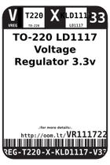

Contents
========

* [VR111722033 > TO-220 LD1117 Voltage Regulator 3.3v](#vr111722033--to-220-ld1117-voltage-regulator-33v)
	* [Datasheets](#datasheets)
	* [Labels](#labels)
	* [EDA](#eda)
	* [Images](#images)
	* [Tags](#tags)

# VR111722033 > TO-220 LD1117 Voltage Regulator 3.3v

- ID: VREG-T220-X-KLD1117-V33D
- Hex ID: VR111722033
- Name: TO-220 LD1117 Voltage Regulator 3.3v
- Description: TO-220 LD1117 Voltage Regulator 3.3v
- Long Link: [http://oom.lt/VREG-T220-X-KLD1117-V33D](http://oom.lt/VREG-T220-X-KLD1117-V33D)
- Short Link: [http://oom.lt/VR111722033](http://oom.lt/VR111722033)

## Datasheets

- Datasheet: [datasheet.pdf](datasheet.pdf)

## Labels
  
  

|label-front|label-inventory|label-spec|
| :---: | :---: | :---: |
||||

## EDA

## Images
  
  

|label-front|label-inventory|label-spec|
| :---: | :---: | :---: |
||||

## Tags

- oompType: VREG
- oompSize: T220
- oompColor: X
- oompDesc: KLD1117
- oompIndex: V33D
- hexID: VR111722033
- oompID: VREG-T220-X-KLD1117-V33D
