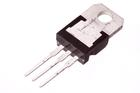
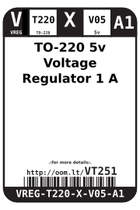
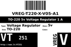
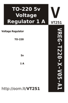

Contents
========

* [VT251 > TO-220 5v Voltage Regulator 1 A](#vt251--to-220-5v-voltage-regulator-1-a)
	* [Images](#images)
	* [Datasheets](#datasheets)
	* [Labels](#labels)
	* [EDA](#eda)
	* [Tags](#tags)
  
![][im]
# VT251 > TO-220 5v Voltage Regulator 1 A

- ID: VREG-T220-X-V05-A1
- Hex ID: VT251
- Name: TO-220 5v Voltage Regulator 1 A
- Description: TO-220 5v Voltage Regulator 1 A

## Images
  
  

|image|image_RE|image_BOTTOM|label-front|label-inventory|label-spec|
| :---: | :---: | :---: | :---: | :---: | :---: |
|||||||

## Datasheets

- Datasheet: [datasheet.pdf](datasheet.pdf)

## Labels
  
  

|label-front|label-inventory|label-spec|
| :---: | :---: | :---: |
||||

## EDA

### Symbols

## Tags

- oompID: VREG-T220-X-V05-A1
- name: TO-220 5v Voltage Regulator 1 A
- hexID: VT251
- oompSort: T2205.001.000
- oompType: VREG
- oompSize: T220
- oompColor: X
- oompDesc: V05
- oompIndex: A1
- oompVersion: 99
- oompClass: Through Hole Component
- oompBbls: template;XXXX-T220-X-XXXX-01-bbls
- oompDiag: template;XXXX-T220-X-XXXX-01-diag
- oompIden: template;XXXX-T220-X-XXXX-01-iden
- oompSimp: template;XXXX-T220-X-XXXX-01-simp
- oompClassCode: THTH
- ooDesignator: U1

[im]: image_450.jpg
