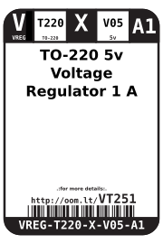

Contents
========

* [VREG-T220-X-V05-A1>TO-220 5v Voltage Regulator 1 A](#vreg-t220-x-v05-a1to-220-5v-voltage-regulator-1-a)
	* [Images](#images)
	* [Datasheets](#datasheets)
	* [Labels](#labels)
	* [EDA](#eda)
		* [Symbols](#symbols)
	* [Tags](#tags)
  
![][im]
# VREG-T220-X-V05-A1>TO-220 5v Voltage Regulator 1 A

- ID: VREG-T220-X-V05-A1
- Name: VREG-T220-X-V05-A1

## Images
  
  

|Main|Reference|Bottom|
| :---: | :---: | :---: |
||||

## Datasheets

- Datasheet: [datasheet.pdf](datasheet.pdf)

## Labels
  
  

|Front|Inventory|Specifications|
| :---: | :---: | :---: |
||||

## EDA

### Symbols

## Tags

- hexID: VT251
- oompSort: T2205.001.000
- oompType: VREG
- oompSize: T220
- oompColor: X
- oompDesc: V05
- oompIndex: A1
- oompVersion: 99
- oompClass: Through Hole Component
- oompBbls: template;XXXX-T220-X-XXXX-01-bbls
- oompDiag: template;XXXX-T220-X-XXXX-01-diag
- oompIden: template;XXXX-T220-X-XXXX-01-iden
- oompSimp: template;XXXX-T220-X-XXXX-01-simp
- oompClassCode: THTH
- ooDesignator: U1

[im]: image_600.jpg
