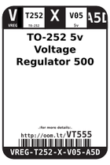
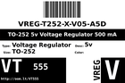
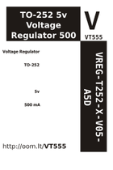
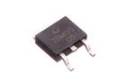
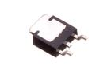

Contents
========

* [VT555 > TO-252 5v Voltage Regulator 500 mA](#vt555--to-252-5v-voltage-regulator-500-ma)
	* [Datasheets](#datasheets)
	* [Labels](#labels)
	* [EDA](#eda)
	* [Images](#images)
	* [Tags](#tags)
  
![][im]
# VT555 > TO-252 5v Voltage Regulator 500 mA

- ID: VREG-T252-X-V05-A5D
- Hex ID: VT555
- Name: TO-252 5v Voltage Regulator 500 mA
- Description: TO-252 5v Voltage Regulator 500 mA
- Long Link: [http://oom.lt/VREG-T252-X-V05-A5D](http://oom.lt/VREG-T252-X-V05-A5D)
- Long Link: [http://oom.lt/VT555](http://oom.lt/VT555)

## Datasheets

- Datasheet: [datasheet.pdf](datasheet.pdf)

## Labels
  
  

|label-front|label-inventory|label-spec|
| :---: | :---: | :---: |
||||

## EDA

### Symbols

## Images
  
  

|image|image_BOTTOM|label-front|label-inventory|label-spec|
| :---: | :---: | :---: | :---: | :---: |
||||||

## Tags

- oompID: VREG-T252-X-V05-A5D
- name: TO-252 5v Voltage Regulator 500 mA
- hexID: VT555
- oompSort: T2525.000.500
- oompType: VREG
- oompSize: T252
- oompColor: X
- oompDesc: V05
- oompIndex: A5D
- oompVersion: 99
- ooManufacturer: C-JCST
- ooManufacturerPartNumber: CJ78M05
- useID: 1
- importance: 1
- useTitle: 
- useDescription: 
- ooSEEEDsku: 1300040P1
- ooSEEEDdesc: Three-terminal positive voltage regulator 0.5A 5V
- ooSEEED3dModel: http://www.seeedstudio.com/wiki/File:TO252.zip
- oompClass: Surface Mount
- oompClassCode: SMDS
- ooDesignator: U1

[im]: image_450.jpg
