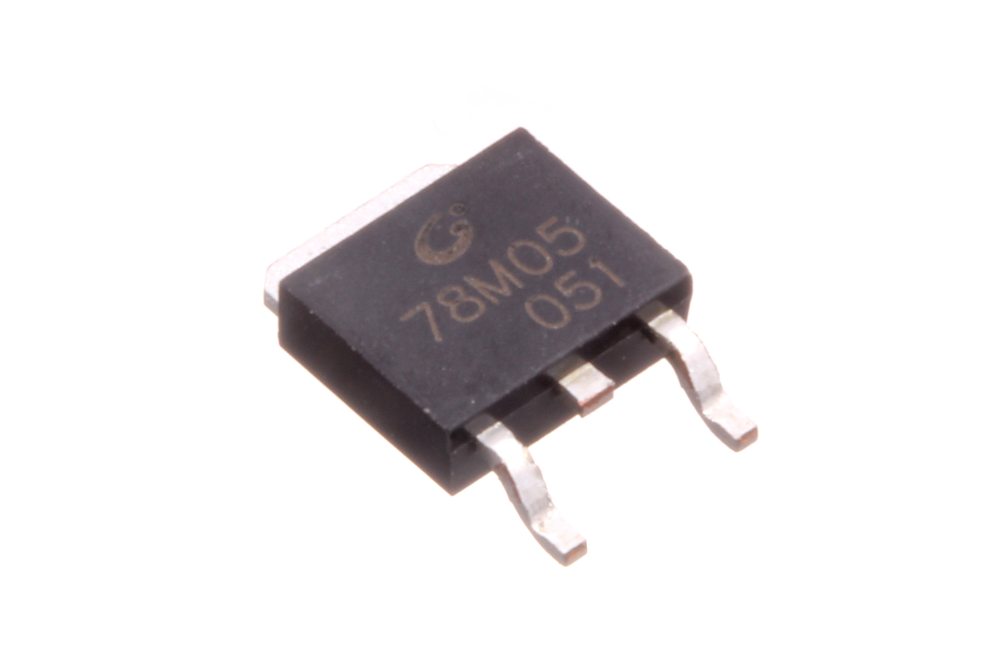
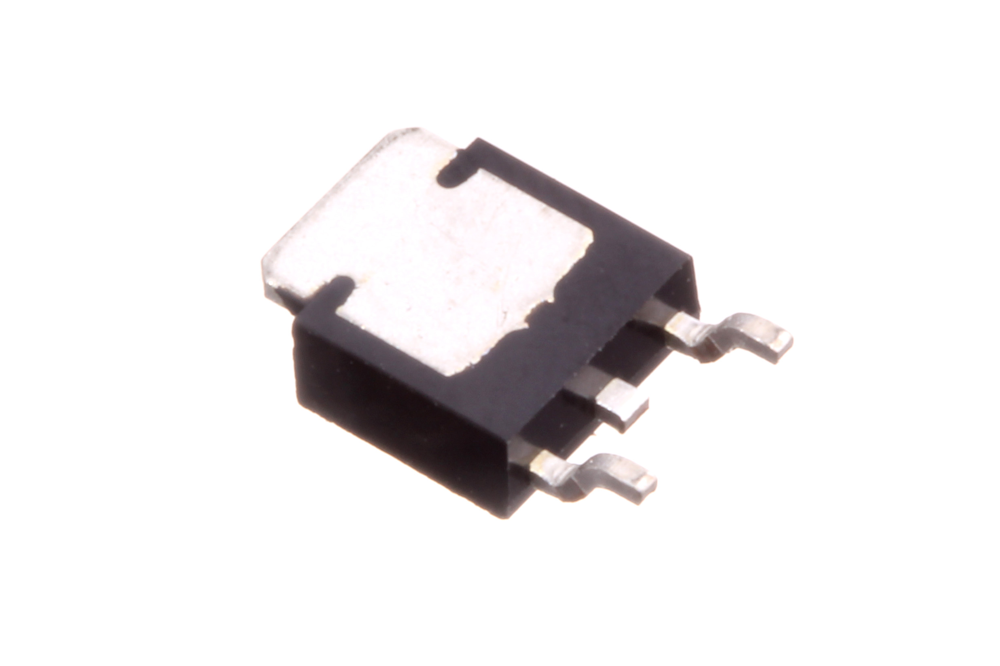

Contents
========

* [VREG-T252-X-V05-A5D>TO-252 5v Voltage Regulator 500 mA](#vreg-t252-x-v05-a5dto-252-5v-voltage-regulator-500-ma)
	* [Images](#images)
	* [Datasheets](#datasheets)
	* [EDA](#eda)
		* [Symbols](#symbols)
	* [Tags](#tags)
  
![][im]
# VREG-T252-X-V05-A5D>TO-252 5v Voltage Regulator 500 mA

- ID: VREG-T252-X-V05-A5D
- Name: VREG-T252-X-V05-A5D

## Images
  
  

|Main|Bottom|
| :---: | :---: |
|||

## Datasheets

- Datasheet: [datasheet.pdf](datasheet.pdf)

## EDA

### Symbols

## Tags

- index: 826
- index: 4324
- oompID: VREG-T252-X-V05-A5D
- name: TO-252 5v Voltage Regulator 500 mA
- hexID: VT555
- oompSort: T2525.000.500
- oompType: VREG
- oompSize: T252
- oompColor: X
- oompDesc: V05
- oompIndex: A5D
- oompVersion: 99
- ooManufacturer: C-JCST
- ooManufacturerPartNumber: CJ78M05
- useID: 1
- importance: 1
- useTitle: 
- useDescription: 
- ooSEEEDsku: 1300040P1
- ooSEEEDdesc: Three-terminal positive voltage regulator 0.5A 5V
- ooSEEED3dModel: http://www.seeedstudio.com/wiki/File:TO252.zip
- oompClass: Surface Mount
- oompClassCode: SMDS
- ooDesignator: U1

[im]: image_600.jpg
