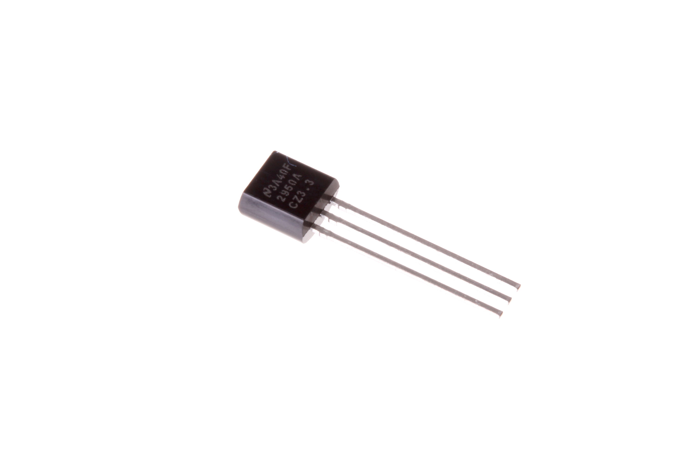
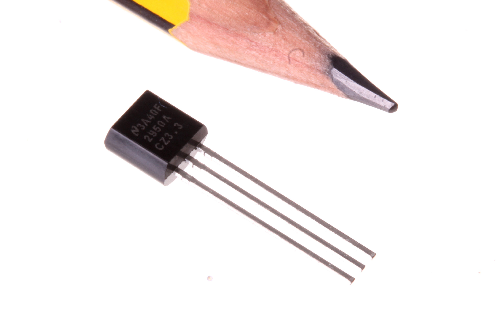
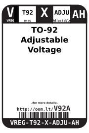
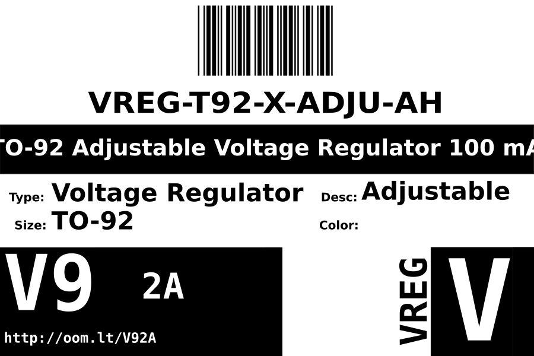
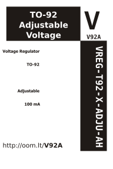

Contents
========

* [VREG-T92-X-ADJU-AH>TO-92 Adjustable Voltage Regulator 100 mA](#vreg-t92-x-adju-ahto-92-adjustable-voltage-regulator-100-ma)
	* [Images](#images)
	* [Datasheets](#datasheets)
	* [Labels](#labels)
	* [EDA](#eda)
		* [Symbols](#symbols)
	* [Tags](#tags)
  
![][im]
# VREG-T92-X-ADJU-AH>TO-92 Adjustable Voltage Regulator 100 mA

- ID: VREG-T92-X-ADJU-AH
- Name: VREG-T92-X-ADJU-AH

## Images
  
  

|Main|Reference|
| :---: | :---: |
|||

## Datasheets

- Datasheet: [datasheet.pdf](datasheet.pdf)

## Labels
  
  

|Front|Inventory|Specifications|
| :---: | :---: | :---: |
||||

## EDA

### Symbols

## Tags

- hexID: V92A
- oompSort: VREGT92ADJU
- oompType: VREG
- oompSize: T92
- oompColor: X
- oompDesc: ADJU
- oompIndex: AH
- oompVersion: 98
- ooNumPins: 3
- ooDesignator: U

[im]: image_600.jpg
