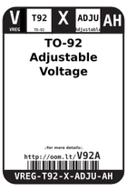

Contents
========

* [V92A > TO-92 Adjustable Voltage Regulator 100 mA](#v92a--to-92-adjustable-voltage-regulator-100-ma)
	* [Datasheets](#datasheets)
	* [Labels](#labels)
	* [EDA](#eda)
	* [Images](#images)
	* [Tags](#tags)
  
![][im]
# V92A > TO-92 Adjustable Voltage Regulator 100 mA

- ID: VREG-T92-X-ADJU-AH
- Hex ID: V92A
- Name: TO-92 Adjustable Voltage Regulator 100 mA
- Description: TO-92 Adjustable Voltage Regulator 100 mA
- Long Link: [http://oom.lt/VREG-T92-X-ADJU-AH](http://oom.lt/VREG-T92-X-ADJU-AH)
- Short Link: [http://oom.lt/V92A](http://oom.lt/V92A)

## Datasheets

- Datasheet: [datasheet.pdf](datasheet.pdf)

## Labels
  
  

|label-front|label-inventory|label-spec|
| :---: | :---: | :---: |
||||

## EDA

### Symbols

## Images
  
  

|image|image_RE|label-front|label-inventory|label-spec|
| :---: | :---: | :---: | :---: | :---: |
||||||

## Tags

- oompID: VREG-T92-X-ADJU-AH
- name: TO-92 Adjustable Voltage Regulator 100 mA
- hexID: V92A
- oompSort: VREGT92ADJU
- oompType: VREG
- oompSize: T92
- oompColor: X
- oompDesc: ADJU
- oompIndex: AH
- oompVersion: 98
- ooNumPins: 3
- ooDesignator: U

[im]: image_450.jpg
