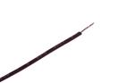
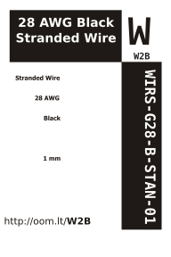

Contents
========

* [WIRS-G28-B-STAN-01>28 AWG Black Stranded Wire](#wirs-g28-b-stan-0128-awg-black-stranded-wire)
	* [Images](#images)
	* [Datasheets](#datasheets)
	* [Labels](#labels)
	* [EDA](#eda)
		* [Symbols](#symbols)
	* [Tags](#tags)
  
![][im]
# WIRS-G28-B-STAN-01>28 AWG Black Stranded Wire

- ID: WIRS-G28-B-STAN-01
- Name: WIRS-G28-B-STAN-01

## Images
  
  

|image|image_RE|
| :---: | :---: |
|||

## Datasheets

- Datasheet: [datasheet.pdf](datasheet.pdf)

## Labels
  
  

|label-front|label-inventory|label-spec|
| :---: | :---: | :---: |
||||

## EDA

### Symbols

## Tags

- oompID: WIRS-G28-B-STAN-01
- name: 28 AWG Black Stranded Wire
- hexID: W2B
- oompSort: 0G28B
- oompType: WIRS
- oompSize: G28
- oompColor: B
- oompDesc: STAN
- oompIndex: 01
- oompVersion: 28
- useID: 1
- importance: 1
- useTitle: 
- useDescription: 
- oompClass: Wiring
- oompClassCode: WIRE

[im]: image_600.jpg
