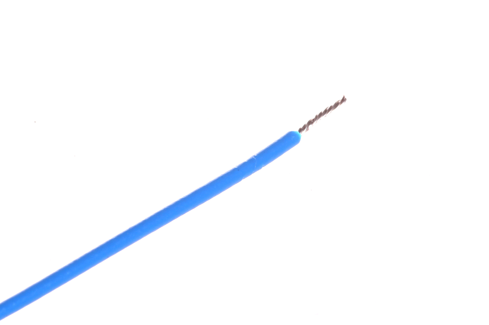
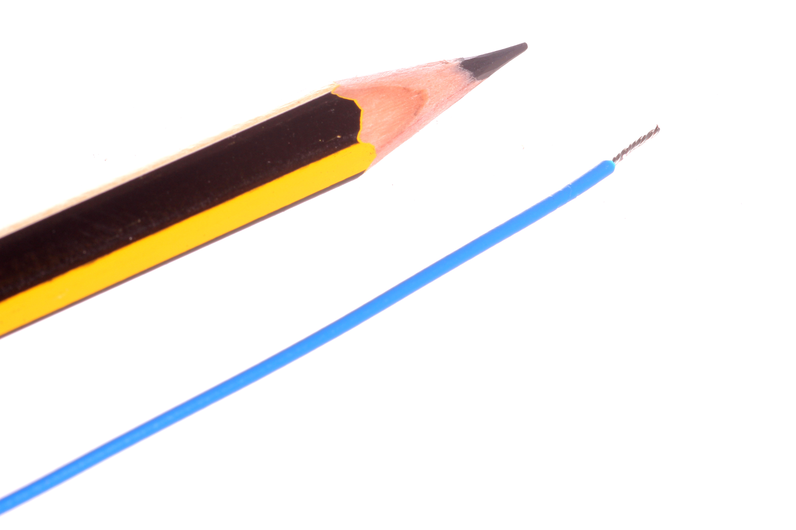

Contents
========

* [WIRS-G28-L-STAN-01>28 AWG Blue Stranded Wire](#wirs-g28-l-stan-0128-awg-blue-stranded-wire)
	* [Images](#images)
	* [Datasheets](#datasheets)
	* [EDA](#eda)
		* [Footprints](#footprints)
		* [Symbols](#symbols)
	* [Tags](#tags)

# WIRS-G28-L-STAN-01>28 AWG Blue Stranded Wire

- ID: WIRS-G28-L-STAN-01
- Name: WIRS-G28-L-STAN-01

## Images
  
  

|Main|Reference|
| :---: | :---: |
|||

## Datasheets

- Datasheet: [datasheet.pdf](datasheet.pdf)

## EDA

### Footprints
  

|||||
| :---: | :---: | :---: | :---: |

### Symbols

## Tags

- index: 831
- index: 4176
- oompID: WIRS-G28-L-STAN-01
- name: 28 AWG Blue Stranded Wire
- hexID: W2L
- oompSort: 0G28L
- oompType: WIRS
- oompSize: G28
- oompColor: L
- oompDesc: STAN
- oompIndex: 01
- oompVersion: 28
- oompClass: Wiring
- oompClassCode: WIRE
