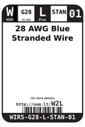
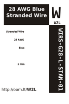

Contents
========

* [W2L > 28 AWG Blue Stranded Wire](#w2l--28-awg-blue-stranded-wire)
	* [Datasheets](#datasheets)
	* [Labels](#labels)
	* [EDA](#eda)
	* [Images](#images)
	* [Tags](#tags)
  
![][im]
# W2L > 28 AWG Blue Stranded Wire

- ID: WIRS-G28-L-STAN-01
- Hex ID: W2L
- Name: 28 AWG Blue Stranded Wire
- Description: 28 AWG Blue Stranded Wire
- Long Link: [http://oom.lt/WIRS-G28-L-STAN-01](http://oom.lt/WIRS-G28-L-STAN-01)
- Long Link: [http://oom.lt/W2L](http://oom.lt/W2L)

## Datasheets

- Datasheet: [datasheet.pdf](datasheet.pdf)

## Labels
  
  

|label-front|label-inventory|label-spec|
| :---: | :---: | :---: |
||||

## EDA

### Symbols

## Images
  
  

|image|image_RE|label-front|label-inventory|label-spec|
| :---: | :---: | :---: | :---: | :---: |
||||||

## Tags

- oompID: WIRS-G28-L-STAN-01
- name: 28 AWG Blue Stranded Wire
- hexID: W2L
- oompSort: 0G28L
- oompType: WIRS
- oompSize: G28
- oompColor: L
- oompDesc: STAN
- oompIndex: 01
- oompVersion: 28
- oompClass: Wiring
- oompClassCode: WIRE

[im]: image_450.jpg
