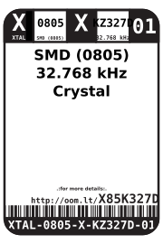
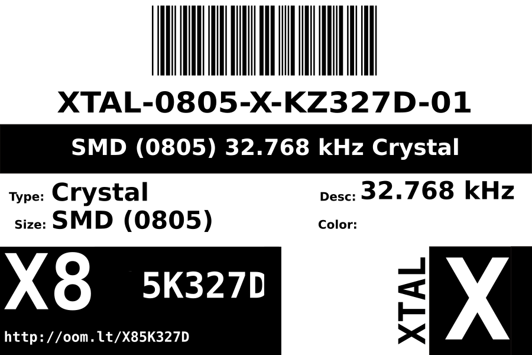
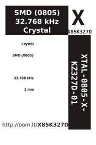

Contents
========

* [XTAL-0805-X-KZ327D-01>SMD (0805) 32.768 kHz Crystal](#xtal-0805-x-kz327d-01smd-0805-32768-khz-crystal)
	* [Datasheets](#datasheets)
	* [Labels](#labels)
	* [EDA](#eda)
		* [Symbols](#symbols)
	* [Tags](#tags)

# XTAL-0805-X-KZ327D-01>SMD (0805) 32.768 kHz Crystal

- ID: XTAL-0805-X-KZ327D-01
- Name: XTAL-0805-X-KZ327D-01

## Datasheets

- Datasheet: [datasheet.pdf](datasheet.pdf)

## Labels
  
  

|Front|Inventory|Specifications|
| :---: | :---: | :---: |
||||

## EDA

### Symbols

## Tags

- oompID: XTAL-0805-X-KZ327D-01
- name: SMD (0805) 32.768 kHz Crystal
- hexID: X85K327D
- oompSort: XTAL0805KZ327D
- oompType: XTAL
- oompSize: 0805
- oompColor: X
- oompDesc: KZ327D
- oompIndex: 01
- oompVersion: 98
- oompBbls: template;XXXX-0805-X-XXXX-XX-bbls
- oompDiag: template;XXXX-0805-X-XXXX-XX-diag
- oompIden: template;XXXX-0805-X-XXXX-XX-iden
- oompSchem: template;XTAL-XXXX-X-XXXX-XX-schem
- oompSimp: template;XXXX-0805-X-XXXX-XX-simp
- ooDesignator: X1
