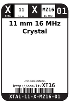
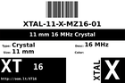
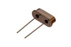

Contents
========

* [XT16 > 11 mm 16 MHz Crystal](#xt16--11-mm-16-mhz-crystal)
	* [Datasheets](#datasheets)
	* [Labels](#labels)
	* [EDA](#eda)
	* [Images](#images)
	* [Tags](#tags)
  
![][im]
# XT16 > 11 mm 16 MHz Crystal

- ID: XTAL-11-X-MZ16-01
- Hex ID: XT16
- Name: 11 mm 16 MHz Crystal
- Description: 11 mm 16 MHz Crystal
- Long Link: [http://oom.lt/XTAL-11-X-MZ16-01](http://oom.lt/XTAL-11-X-MZ16-01)
- Short Link: [http://oom.lt/XT16](http://oom.lt/XT16)

## Datasheets

- Datasheet: [datasheet.pdf](datasheet.pdf)

## Labels
  
  

|label-front|label-inventory|label-spec|
| :---: | :---: | :---: |
||||

## EDA

### Symbols

## Images
  
  

|image|image_RE|image_BOTTOM|label-front|label-inventory|label-spec|
| :---: | :---: | :---: | :---: | :---: | :---: |
|||||||

## Tags

- oompID: XTAL-11-X-MZ16-01
- name: 11 mm 16 MHz Crystal
- hexID: XT16
- oompSort: THTH16000000
- oompType: XTAL
- oompSize: 11
- oompColor: X
- oompDesc: MZ16
- oompIndex: 01
- oompVersion: 20
- ooPitch: 4.88 mm
- ooWidth: 4.65 mm
- ooHeight: 3.5 mm
- ooLength: 11.05 mm
- com: SMD
- ooPackageMarking: 16.000
- ooNumPins: 2
- oompAbout: A 16MHz Crystal, in a commonly used through hole size.
- useID: 1
- importance: 1
- useTitle: Clock for a Microcontroller
- useDescription: Used to provide a clock source to a microcontroller. Commonly used with Atmel 8bit microcontrollers operating at 5v.
- oompClass: Through Hole Component
- oompClassCode: THTH
- oompSchem: template;XTAL-XXXX-X-XXXX-XX-schem
- ooDesignator: X1

[im]: image_450.jpg
