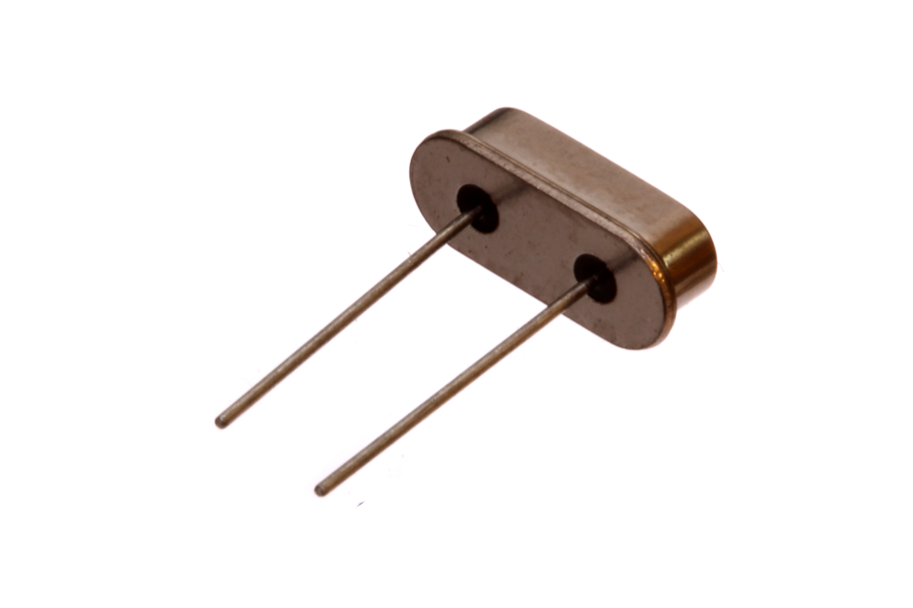
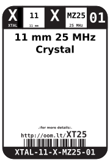
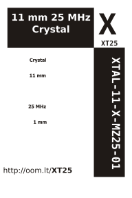

Contents
========

* [XTAL-11-X-MZ25-01>11 mm 25 MHz Crystal](#xtal-11-x-mz25-0111-mm-25-mhz-crystal)
	* [Images](#images)
	* [Datasheets](#datasheets)
	* [Labels](#labels)
	* [EDA](#eda)
		* [Symbols](#symbols)
	* [Tags](#tags)
  
![][im]
# XTAL-11-X-MZ25-01>11 mm 25 MHz Crystal

- ID: XTAL-11-X-MZ25-01
- Name: XTAL-11-X-MZ25-01

## Images
  
  

|Main|Reference|Bottom|
| :---: | :---: | :---: |
||||

## Datasheets

- Datasheet: [datasheet.pdf](datasheet.pdf)

## Labels
  
  

|Front|Inventory|Specifications|
| :---: | :---: | :---: |
||||

## EDA

### Symbols

## Tags

- oompID: XTAL-11-X-MZ25-01
- name: 11 mm 25 MHz Crystal
- hexID: XT25
- oompSort: 
- oompClass: Through Hole
- oompClassCode: THTH
- oompType: XTAL
- oompSize: 11
- oompColor: X
- oompDesc: MZ25
- oompIndex: 01
- oompVersion: 40
- oompSchem: template;XTAL-XXXX-X-XXXX-XX-schem
- ooDesignator: X1

[im]: image_600.jpg
