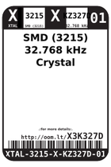
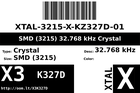
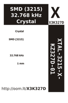
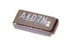
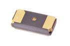

Contents
========

* [X3K327D > SMD (3215) 32.768 kHz Crystal](#x3k327d--smd-3215-32768-khz-crystal)
	* [Datasheets](#datasheets)
	* [Labels](#labels)
	* [EDA](#eda)
	* [Images](#images)
	* [Tags](#tags)
  
![][im]
# X3K327D > SMD (3215) 32.768 kHz Crystal

- ID: XTAL-3215-X-KZ327D-01
- Hex ID: X3K327D
- Name: SMD (3215) 32.768 kHz Crystal
- Description: SMD (3215) 32.768 kHz Crystal
- Long Link: [http://oom.lt/XTAL-3215-X-KZ327D-01](http://oom.lt/XTAL-3215-X-KZ327D-01)
- Short Link: [http://oom.lt/X3K327D](http://oom.lt/X3K327D)

## Datasheets

- Datasheet: [datasheet.pdf](datasheet.pdf)

## Labels
  
  

|label-front|label-inventory|label-spec|
| :---: | :---: | :---: |
||||

## EDA

### Symbols

## Images
  
  

|image|image_BOTTOM|label-front|label-inventory|label-spec|
| :---: | :---: | :---: | :---: | :---: |
||||||

## Tags

- oompID: XTAL-3215-X-KZ327D-01
- name: SMD (3215) 32.768 kHz Crystal
- hexID: X3K327D
- oompSort: 
- oompClass: Surface Mount
- oompClassCode: SMDS
- oompType: XTAL
- oompSize: 3215
- oompColor: X
- oompDesc: KZ327D
- oompIndex: 01
- oompVersion: 40
- oompSchem: template;XTAL-XXXX-X-XXXX-XX-schem
- ooDesignator: X1

[im]: image_450.jpg
