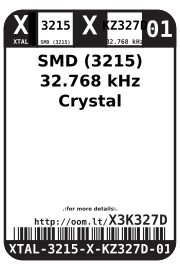
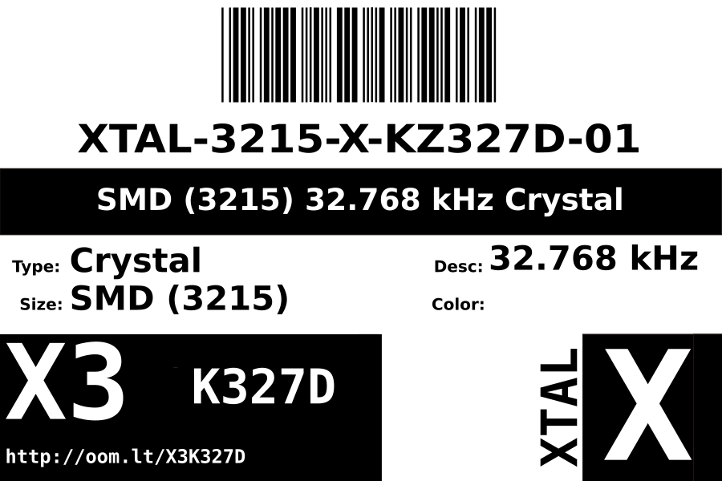
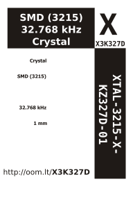

Contents
========

* [XTAL-3215-X-KZ327D-01>SMD (3215) 32.768 kHz Crystal](#xtal-3215-x-kz327d-01smd-3215-32768-khz-crystal)
	* [Images](#images)
	* [Datasheets](#datasheets)
	* [Labels](#labels)
	* [EDA](#eda)
		* [Symbols](#symbols)
	* [Tags](#tags)
  
![][im]
# XTAL-3215-X-KZ327D-01>SMD (3215) 32.768 kHz Crystal

- ID: XTAL-3215-X-KZ327D-01
- Name: XTAL-3215-X-KZ327D-01

## Images
  
  

|Main|Bottom|
| :---: | :---: |
|||

## Datasheets

- Datasheet: [datasheet.pdf](datasheet.pdf)

## Labels
  
  

|Front|Inventory|Specifications|
| :---: | :---: | :---: |
||||

## EDA

### Symbols

## Tags

- index: 842
- oompID: XTAL-3215-X-KZ327D-01
- name: SMD (3215) 32.768 kHz Crystal
- hexID: X3K327D
- oompSort: 
- oompClass: Surface Mount
- oompClassCode: SMDS
- oompType: XTAL
- oompSize: 3215
- oompColor: X
- oompDesc: KZ327D
- oompIndex: 01
- oompVersion: 40
- oompSchem: template;XTAL-XXXX-X-XXXX-XX-schem
- ooDesignator: X1

[im]: image_600.jpg
