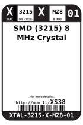
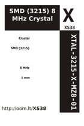

Contents
========

* [XS38 > SMD (3215) 8 MHz Crystal](#xs38--smd-3215-8-mhz-crystal)
	* [Images](#images)
	* [Labels](#labels)
	* [EDA](#eda)
	* [Tags](#tags)

# XS38 > SMD (3215) 8 MHz Crystal

- ID: XTAL-3215-X-MZ8-01
- Hex ID: XS38
- Name: SMD (3215) 8 MHz Crystal
- Description: SMD (3215) 8 MHz Crystal

## Images
  
  

|label-front|label-inventory|label-spec|
| :---: | :---: | :---: |
||||

## Labels
  
  

|label-front|label-inventory|label-spec|
| :---: | :---: | :---: |
||||

## EDA

### Symbols

## Tags

- oompID: XTAL-3215-X-MZ8-01
- name: SMD (3215) 8 MHz Crystal
- hexID: XS38
- oompSort: XTAL3215MZ8
- oompType: XTAL
- oompSize: 3215
- oompColor: X
- oompDesc: MZ8
- oompIndex: 01
- oompVersion: 98
- ooWidth: 1.5 mm
- ooLength: 3.2 mm
- ooNumPins: 2
- ooDesignator: X
