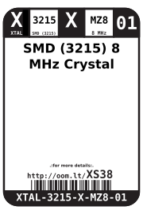
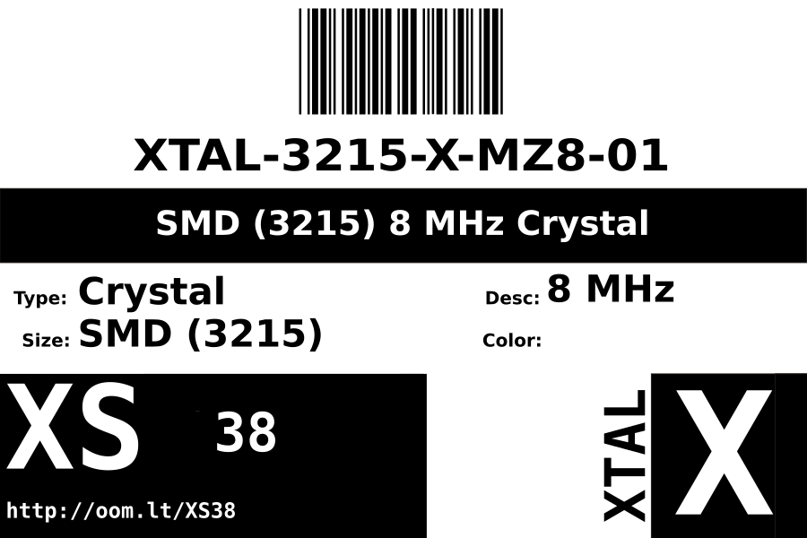

Contents
========

* [XTAL-3215-X-MZ8-01>SMD (3215) 8 MHz Crystal](#xtal-3215-x-mz8-01smd-3215-8-mhz-crystal)
	* [Datasheets](#datasheets)
	* [Labels](#labels)
	* [EDA](#eda)
		* [Symbols](#symbols)
	* [Tags](#tags)

# XTAL-3215-X-MZ8-01>SMD (3215) 8 MHz Crystal

- ID: XTAL-3215-X-MZ8-01
- Name: XTAL-3215-X-MZ8-01

## Datasheets

- Datasheet: [datasheet.pdf](datasheet.pdf)

## Labels
  
  

|Front|Inventory|Specifications|
| :---: | :---: | :---: |
||||

## EDA

### Symbols

## Tags

- hexID: XS38
- oompSort: XTAL3215MZ8
- oompType: XTAL
- oompSize: 3215
- oompColor: X
- oompDesc: MZ8
- oompIndex: 01
- oompVersion: 98
- ooWidth: 1.5 mm
- ooLength: 3.2 mm
- ooNumPins: 2
- ooDesignator: X
