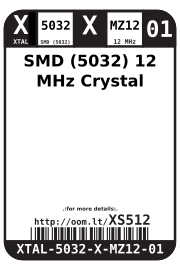
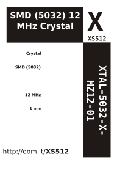

Contents
========

* [XTAL-5032-X-MZ12-01>SMD (5032) 12 MHz Crystal](#xtal-5032-x-mz12-01smd-5032-12-mhz-crystal)
	* [Images](#images)
	* [Datasheets](#datasheets)
	* [Labels](#labels)
	* [EDA](#eda)
		* [Symbols](#symbols)
	* [Tags](#tags)
  
![][im]
# XTAL-5032-X-MZ12-01>SMD (5032) 12 MHz Crystal

- ID: XTAL-5032-X-MZ12-01
- Name: XTAL-5032-X-MZ12-01

## Images
  
  

|image|image_BOTTOM|
| :---: | :---: |
|||

## Datasheets

- Datasheet: [datasheet.pdf](datasheet.pdf)

## Labels
  
  

|label-front|label-inventory|label-spec|
| :---: | :---: | :---: |
||||

## EDA

### Symbols

## Tags

- oompID: XTAL-5032-X-MZ12-01
- name: SMD (5032) 12 MHz Crystal
- hexID: XS512
- oompSort: 
- oompClass: Surface Mount
- oompClassCode: SMDS
- oompType: XTAL
- oompSize: 5032
- oompColor: X
- oompDesc: MZ12
- oompIndex: 01
- oompVersion: 40
- oompSchem: template;XTAL-XXXX-X-XXXX-XX-schem
- ooDesignator: X1

[im]: image_600.jpg
