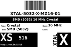
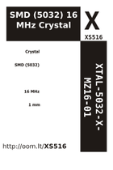
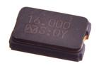
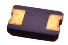

Contents
========

* [XS516 > SMD (5032) 16 MHz Crystal](#xs516--smd-5032-16-mhz-crystal)
	* [Datasheets](#datasheets)
	* [Labels](#labels)
	* [EDA](#eda)
	* [Images](#images)
	* [Tags](#tags)
  
![][im]
# XS516 > SMD (5032) 16 MHz Crystal

- ID: XTAL-5032-X-MZ16-01
- Hex ID: XS516
- Name: SMD (5032) 16 MHz Crystal
- Description: SMD (5032) 16 MHz Crystal
- Long Link: [http://oom.lt/XTAL-5032-X-MZ16-01](http://oom.lt/XTAL-5032-X-MZ16-01)
- Long Link: [http://oom.lt/XS516](http://oom.lt/XS516)

## Datasheets

- Datasheet: [datasheet.pdf](datasheet.pdf)

## Labels
  
  

|label-front|label-inventory|label-spec|
| :---: | :---: | :---: |
||||

## EDA

### Symbols

## Images
  
  

|image|image_BOTTOM|label-front|label-inventory|label-spec|
| :---: | :---: | :---: | :---: | :---: |
||||||

## Tags

- oompID: XTAL-5032-X-MZ16-01
- name: SMD (5032) 16 MHz Crystal
- hexID: XS516
- oompSort: 
- oompClass: Surface Mount
- oompClassCode: SMDS
- oompType: XTAL
- oompSize: 5032
- oompColor: X
- oompDesc: MZ16
- oompIndex: 01
- oompVersion: 40
- oompSchem: template;XTAL-XXXX-X-XXXX-XX-schem
- ooDesignator: X1

[im]: image_450.jpg
