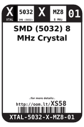

Contents
========

* [XS58 > SMD (5032) 8 MHz Crystal](#xs58--smd-5032-8-mhz-crystal)
	* [Images](#images)
	* [Datasheets](#datasheets)
	* [Labels](#labels)
	* [EDA](#eda)
	* [Tags](#tags)

# XS58 > SMD (5032) 8 MHz Crystal

- ID: XTAL-5032-X-MZ8-01
- Hex ID: XS58
- Name: SMD (5032) 8 MHz Crystal
- Description: SMD (5032) 8 MHz Crystal

## Images
  
  

|label-front|label-inventory|label-spec|
| :---: | :---: | :---: |
||||

## Datasheets

- Datasheet: [datasheet.pdf](datasheet.pdf)

## Labels
  
  

|label-front|label-inventory|label-spec|
| :---: | :---: | :---: |
||||

## EDA

### Symbols

## Tags

- oompID: XTAL-5032-X-MZ8-01
- name: SMD (5032) 8 MHz Crystal
- hexID: XS58
- oompSort: 
- oompClass: Surface Mount
- oompClassCode: SMDS
- oompType: XTAL
- oompSize: 5032
- oompColor: X
- oompDesc: MZ8
- oompIndex: 01
- oompVersion: 40
- oompSchem: template;XTAL-XXXX-X-XXXX-XX-schem
- ooDesignator: X1
